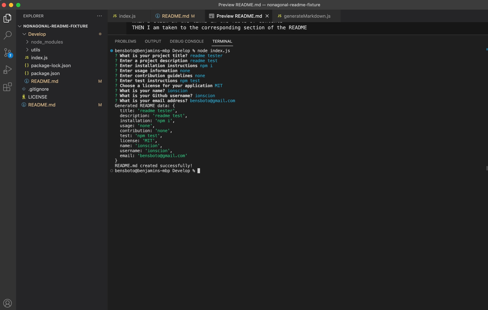

# 09 Node.js Challenge: Professional README Generator

## User Story

```md
AS A developer
I WANT a README generator
SO THAT I can quickly create a professional README for a new project
```

## Acceptance Criteria

```md
GIVEN a command-line application that accepts user input
WHEN I am prompted for information about my application repository
THEN a high-quality, professional README.md is generated with the title of my project and sections entitled Description, Table of Contents, Installation, Usage, License, Contributing, Tests, and Questions
WHEN I enter my project title
THEN this is displayed as the title of the README
WHEN I enter a description, installation instructions, usage information, contribution guidelines, and test instructions
THEN this information is added to the sections of the README entitled Description, Installation, Usage, Contributing, and Tests
WHEN I choose a license for my application from a list of options
THEN a badge for that license is added near the top of the README and a notice is added to the section of the README entitled License that explains which license the application is covered under
WHEN I enter my GitHub username
THEN this is added to the section of the README entitled Questions, with a link to my GitHub profile
WHEN I enter my email address
THEN this is added to the section of the README entitled Questions, with instructions on how to reach me with additional questions
WHEN I click on the links in the Table of Contents
THEN I am taken to the corresponding section of the README
```

## Developer Notes
This application uses the Inquirer command line interface to help you generate a readme. 
Follow these steps initiate the Readme:
- Right click the index.js file and select "open in integrated terminal"
- Run the following command: node index.js
- Prompts will appear and you will need to enter your responses to each one.
- Press enter after each entry to be presented with the next item in the list. 
- Upon completing all items, a message "README.md created successfully!" will appear in the command line.
- The new README.md file will be present in the Develop folder, save for your future use.

License badge that is displayed at the top of the page is also a link to a website describing the license chosen.


Here is a screenshot of the app being initialized and what the prompts and answers may look like:



Note, in this image, the newly generated Readme file is the one directly underneath package.json.

### Walkthrough Video: 

The following link contains the walkthrough video in it's entirety:

https://drive.google.com/file/d/18I8SIBjGswDNGMf2AluyNGO8NycIFO2i/view


---

